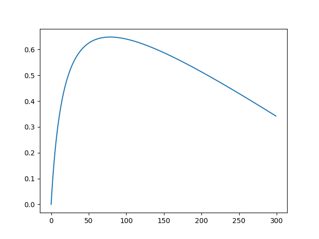
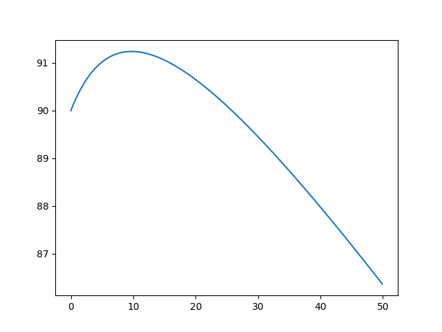

目标函数为：
$$f(x,y) = \frac{a \cdot b + x \cdot y}{b + y}-k \cdot x \cdot y$$

$$\frac{\partial f(x,y)}{\partial x} = (\frac{1}{y+b}-k)\cdot y$$
$$\frac{\partial f(x,y)}{\partial y} = \frac{k\cdot(x-a)}{(y+b)^2)}-k \cdot x$$
$$\frac{\partial f(x,y)}{\partial y} = 0 \Rightarrow y = \sqrt{\left|\frac{x-a}{k\cdot x}\right|}-b$$

